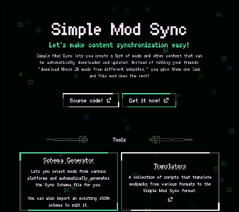

# Simple Mod Sync

A simple way to share and sync mods, resource packs, shaders, and other Minecraft content with your friends or community.

## What is Simple Mod Sync?

Simple Mod Sync lets you create a list of mods and other content that can be automatically downloaded and updated. Instead of telling your friends "download these 20 mods from different websites," you give them one link and this mod does the rest!

Think of it like a shopping list, but for Minecraft content. You write down what you want (the URLs to download files), and Simple Mod Sync goes shopping for you.

### Need a video? *(might be outdated)*

## Usage

If you are just downloading this mod because somebody sent you, you probably
just need to download the mod, put it into the mods file and be gone.

If you are the one hosting the server and/or managing the mods, look into the
[Docs file](./DOCS.md).

### Checkout the website

The website provides a tool for maintaining your schema file and adding content from various content platforms such as Modrinth and Curseforge.

## Found a bug or a crash?

Please let me know! The best way how to make this mod better for everyone is to share problems and issues!

Report bugs and crashes [here](https://github.com/oxydien/simple-mod-sync/issues).

### What to include for crash *(or bugs)*?

Please specify your **game version** and **mod loader**. If possible provide the **log file**.

### Have a question?

Create an **issue** with your question [here](https://github.com/oxydien/simple-mod-sync/issues). Or contact me directly on any of [these](https://www.oxydien.dev/#socials).

In any case try to provide as much information as possible, it's easier to work with more context.

## For Developers

Want to contribute? Whether it's reporting an issue or submitting a pull request, your help is highly appreciated!

- [Open an Issue](https://github.com/oxydien/simple-mod-sync/issues/new)
- [Create a Pull Request](https://github.com/oxydien/simple-mod-sync/pulls)

### Testing

If you want to test whether your version works as intended, you can try any of the files saved in the [tests/schemaFiles](tests/shemaFiles) directory.

## License

This mod is licensed under the MIT License. See the [LICENSE file](./LICENSE) for more details.
